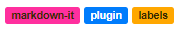

# markdown-it-label

[](https://www.npmjs.com/package/markdown-it-label) [](https://github.com/Bioruebe/markdown-it-label/actions/workflows/node.js.yml) 

> A markdown-it plugin, which adds labels/tags

## Preview



## Usage

### Install

```bash
npm install markdown-it-label
```

### Enable

```js
// ESM
import MarkdownIt from "markdown-it";
import MarkdownItLabel from "markdown-it-label";
const md = new MarkdownIt().use(MarkdownItLabel, options);

// CommonJS
const markdown_it = require("markdown-it");
const markdown_it_label = require("markdown-it-label");
const md = markdown_it().use(markdown_it_label, options);
```

### Syntax

```md
#[Label text](color)
```

e.g.

```md
#[important](red)
```

is interpreted as

```html
<p>
    <span class="label" style="background-color: rgb(255, 0, 0); color: white;">
        important
    </span>
</p>
```

#### Colors

Colors can be specified in multiple ways:

- [Color names](https://www.w3schools.com/colors/colors_names.asp): `red`, `gold`, `WhiteSmoke`
- Hex colors: `#FF0000`, `#F5F5F5`
- Shorthand hexadecimal form: `#000`, `#09C`

The background color is set automatically based on the brightness of the background. Dark and light text colors can be set via options object.

##### Shorthand usage

The color of each label has to be defined only once in the document. Any label with the same text will then use it without explicitly specifying it. It does not matter if the label is defined before or after the shorthand usage.

```md
## Define label color anywhere in the document
#[important](yellow)

## Use shorthand without the color argument
#[important]()

## You can override the color on a per-label basis
** This label is red **
#[important](red)

** All others are yellow **
#[important]()
```


### Example CSS

```css
.mdi-label {
    padding: .2em .6em .3em;
    font-size: 75%;
    font-weight: 700;
    white-space: nowrap;
    vertical-align: baseline;
    border-radius: .25em;
}

.mdi-label-text-light {
    color: white
}

.mdi-label-text-dark {
    color: #332900
}
```

## Options

###### Default values

```js
{
    cssClassLabel: "mdi-label",
    cssClassTextLight: "mdi-label-text-light",
    cssClassTextDark: "mdi-label-text-dark"
}
```

###### cssClassLabel

The class to assign to the `span` element. Useful for styling the label.

###### cssClassTextLight, cssClassTextDark

The CSS class to be used for the label text. Which of the two is used depends on the background color and is chosen automatically to ensure proper contrast.
